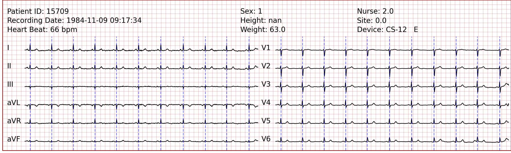
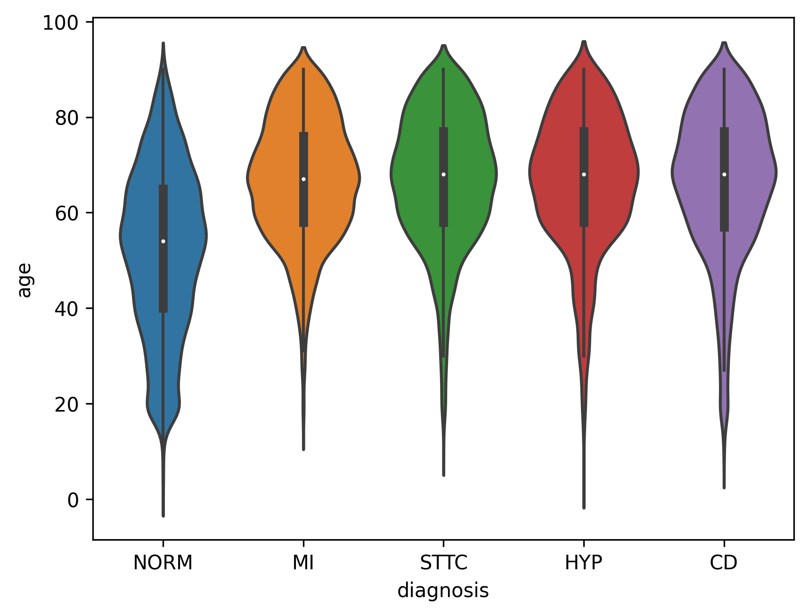
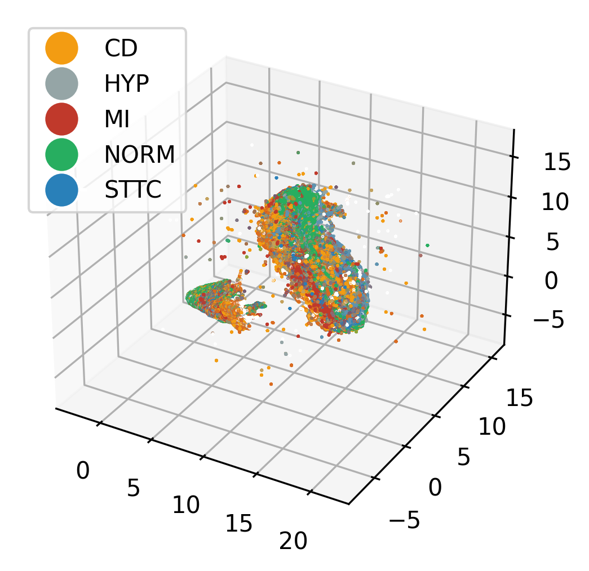

# Introduction

This is an exporation and analysis of the PTB-XL dataset. I will explain te tasks done in this analysis in the following sections. The `requirements.txt` and `Dockerfile` are also included in this repository.

# Dataset

The `PTB-XL` dataset contains both 100Hz and 500Hz ECG recordings with the duration of 10 seconds. Some patient information is also included in this dataset. The 100Hz data was used in this analysis. We load the dataset using the code the dataset creators have provided.

# Displaying the Signals

The recordings have 12 channels, and important patient information along with the signals have to be shown approprietly to the doctor to make a valid diagnosis. For this reason, I have used Jupyter Notebook widgets to create a simple UI that takes in the record number and displays patient information and the signals, and an indicator of the position of the peak or the `R` section. An example plot is shown in `Image 1`. The signals are denoised and scaled before they are displayed. The denoising process contains a high-pass filter to remove the drift from the signals. The scaling is done so that the signals don't intersect with each other and be easier to read. For peak detection, the peak finder algorithm from `Scipy` signal processing library is used.


> Image 1: Patient information and ECG signals panel

# Statistical Analysis

In order to have a statistical view at this dataset, I have analyzed the relation of age, height, and weight of the patients with the diagnosis. First, I have created a violin plot containing the distribution of age considering each diagnosis superclass. The plot is shown in `Image 2`. As can be seen from the figure, Healthier people have a lower age average compared to other diagnosis classes. One interpretation might be that heart problems start to show themselves in advanced ages.


> Image 2: Violin plot of the distribution of age in each superclass

Afterward, the relation between diagnosis superclass and height and weight are tested using statistical tests, specifically t-test. The alpha level used for the tests is 0.001. The p-value of the tests is shown below:

```
Normal vs STTC height test p-value: 0.000002
Normal vs MI height test p-value: 0.065118
Normal vs CD height test p-value: 0.338170
Normal vs HYP height test p-value: 0.019416

Normal vs STTC weight test p-value: 0.000001
Normal vs MI weight test p-value: 0.330591
Normal vs CD weight test p-value: 0.035482
Normal vs HYP weight test p-value: 0.000007
```

The results indicate that height and weight is significantly different in normal people compared to people diagnosed with STTC. Also, weight is significantly different in normal people compared to people diagnosed with HYP. **These results can be used to calculate risk factor for normal people with wearable devices, possibly increasing the market share of the company**.

# Diagnosis Classification

The dataset contains diagnosis superclasses, and the signals and the annotations can be used to form a classification task. This is a multi-class classifcation task. There are some deep learning methods to solve this task. I have worked in the field of applied deep learning, however, I decided to take another route here. I extracted individual heartbeats and padded or cut them to have 85 values for each heartbeat. I then used PCA dimension reduction alongside the SVM classifier to solve this task. One-vs-rest method is used in order to be able to employ the SVM classifier. This setup can have its own benefits because **after the training is done and it is time to make predictions, the only computation that has to be done is a matrix multiplication and a few weighted sums. This can be extremely computationaly efficient compared to deep learning methods, and can be used as an early and inexact diagnosis on an embedded device**. I have used a linear SVM classifier because using RBF SVM takes too long and doesn't fit into the time frame of the project. The accuracies for 5-fold classification are `78.195, 76.317, 76.363, 76.441, 75.392` with a mean value of `76.541`. Is it more likely that higher accuracies can be reached if non-linear SVM is used.

# Feature Visualization

We can visualize the feature space of the features that we have extracted from the individual heartbeats. I have used UMAP to visualize the feature space. The figure is shown in `Image 3`. 


> Image 3: Visualization of the feature space with colorization based on superclasses.

# Final Words

Working with ECG data is quite exciting for me. Preprocessing and using the right filters is an important step in ECG diagnosis. As a general rule, higher accuracies come with greater runtimes, specially when using deep learning. Having a classifier with a high accuracy is great when you have the resources, however, when running on wearable devices, a much lighter and faster solution must be deployed. Deeper and better analysis can be done, but keeping the interview project timeline is of importance too.